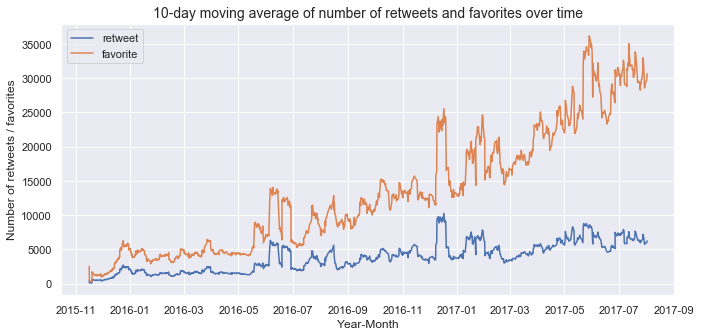

# Wrangle and Analyze Twitter Data
This project has been completed as part of the [Udacity's Data Analyst Nanodegree](https://www.udacity.com/course/data-analyst-nanodegree--nd002) requirements.

## Overview
In this project tweet data from the popular [WeRateDogs](https://twitter.com/dog_rates) twitter account are gathered, assessed, cleaned, analyzed and visualized.

The main effort in this project was to gather, assess and clean the data.
A summary of the findings can be found in the two pdf files in the repository.
Detailed analysis is provided in the jupyter notebook file (.ipynb) in the repository.

### Data gathering
Data for the tweets are gathered from:
- an archive file provided from Udacity
- through the twitter API to gather additional information (retweet and favorite counts) for those tweets that are contained in the archive

In addition, image prediction data are also gathered through a url provided from Udacity.

### Data assessment
Data have been assessed for quality and tidiness issues.

Example of quality issues with regard to the data:
- Completeness
- Validity
- Accuracy
- Consistency

Format of tidiness followed:
- Each variable forms a column
- Each observation forms a row
- Each type of observational unit forms a table

Visual and programmatic assessment has been applied to the data to identify quality and tidiness issues.

### Data cleaning
The issues identified have been cleaned.

For the cleaning process the following format is applied:
- Define
- Code
- Test

Between the cleaning steps, re-assessment of the data has been performed.

### Data Analysis and Visualization
After cleaning the data, analysis and visualization is performed, in order to gain insights regarding the tweets and the twitter account.

## Technologies used

- Python
- Libraries: Pandas, NumPy, Tweepy, Requests, OS, JSON, GLOB, Image, BytesIO, MatPlotlib, Seaborn
- Jupyter Notebook

## Snapshot from the Exploratory Data Analysis

The following Figure shows the popularity of the tweets over time.
Specifically, it shows the 10-day moving average of the number of retweets and favorites from November 2015 to August 2017 (the number of retweets and favorites has been gathered through the use of the twitter API).
<!---

-->

  

